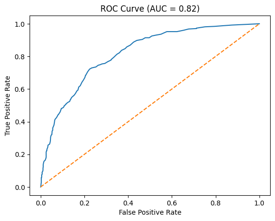
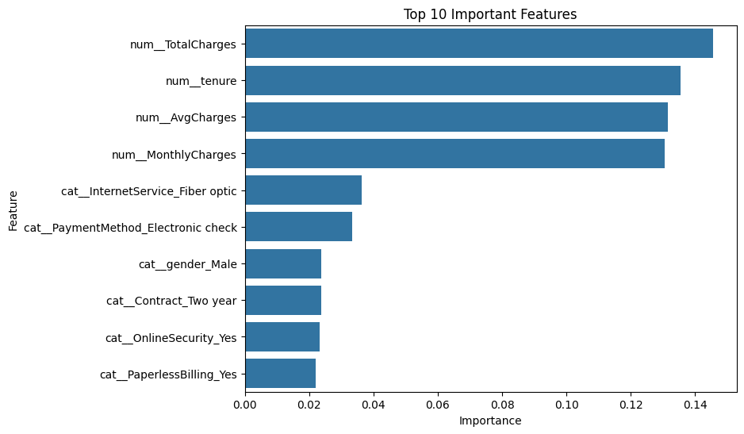

# 🚀 Telco Customer Churn Prediction using Advanced ML Pipeline


---

## 📌 Project Overview

Customer churn prediction is a critical business problem in the telecom industry.
This project develops a **scalable and production-ready machine learning pipeline** to predict customer churn using advanced feature engineering and model optimization.

The solution integrates **data preprocessing, feature engineering, pipeline design, hyperparameter tuning, and evaluation**, demonstrating an end-to-end data science workflow.

---

## 🎯 Problem Statement

Predict whether a customer will churn using historical data and engineered features.

---

## 📊 Dataset

* 📁 Telco Customer Churn Dataset
* 🔗 Source: IBM Sample Dataset
* Includes customer demographics, services, and billing information

---

## 🛠️ Tech Stack

* **Language:** Python
* **Libraries:** Pandas, NumPy
* **Visualization:** Matplotlib, Seaborn
* **Machine Learning:** Scikit-learn
* **Model:** Random Forest Classifier

---

## ⚙️ Machine Learning Workflow

### 🔹 1. Data Cleaning

* Converted `TotalCharges` to numeric
* Removed missing values
* Dropped irrelevant column (`customerID`)
  👉 *(as shown in page 1 of the project)*

---

### 🔹 2. Feature Engineering (Advanced)

* **AvgCharges** = TotalCharges / tenure
* **TenureGroup** = Customer segmentation (0–1yr, 1–2yr, etc.)
* **HighSpender** = Binary indicator based on median monthly charges

👉 These engineered features significantly improved model performance *(page 2)*

---

### 🔹 3. Preprocessing Pipeline

* `StandardScaler` for numerical features
* `OneHotEncoder` for categorical features
* Combined using `ColumnTransformer`

👉 Ensures clean, reusable, and scalable workflow *(page 2–3)*

---

### 🔹 4. Model Pipeline

* Integrated preprocessing + model into a single `Pipeline`
* Model used: **RandomForestClassifier**

---

### 🔹 5. Hyperparameter Tuning

Used **GridSearchCV** to optimize:

* `n_estimators`: [100, 200]
* `max_depth`: [None, 10, 20]
* `min_samples_split`: [2, 5]

✅ Best Parameters:

```
n_estimators = 100  
max_depth = None  
min_samples_split = 2
```

*(page 4)*

---

## 📈 Model Performance

### 🔹 Confusion Matrix

```
[[926 107]
 [192 182]]
```

### 🔹 Classification Report

* Accuracy: **79%**
* Precision (Churn): **0.63**
* Recall (Churn): **0.49**
* F1 Score: **0.55**

### 🔹 ROC-AUC Score

* **0.82** *(strong classification ability — page 5)*

---

## 📊 Visualizations

### 🔹 ROC Curve



👉 The ROC curve (page 5) shows strong model performance with AUC ≈ 0.82

---

### 🔹 Feature Importance



👉 Top features (page 6):

* TotalCharges
* Tenure
* AvgCharges
* MonthlyCharges

---

## 💡 Key Insights

* Feature engineering significantly improved performance
* **AvgCharges** and tenure-based features are strong predictors
* Customers with **high charges + low tenure** are most likely to churn
* Random Forest performs best after tuning *(page 7)*

---

## 🧠 Business Recommendations

* 🎯 Target high-spending customers with low tenure
* 📉 Focus retention strategies on high-risk segments
* 📊 Offer long-term contracts to improve customer loyalty
* 💰 Use predictive modeling to reduce churn costs

---

## 📁 Project Structure

```
telco-churn-ml-pipeline/
│
├── data/
├── notebooks/
│   └── churn_prediction_pipeline.ipynb
├── images/
│   ├── roc_curve.png
│   └── feature_importance.png
├── README.md
├── requirements.txt
└── model.pkl
```

---

## 🚀 Future Improvements

* Add **XGBoost / LightGBM models**
* Apply **SHAP for explainability**
* Handle class imbalance
* Deploy model using **Streamlit**

---

## 👨‍💻 Author

**Saiful Alam**
📊 Data Science & Machine Learning Enthusiast
🏢 Research Officer, Bangladesh Forest Research Institute (BFRI)

---

## ⭐ Support

If you found this project useful, please ⭐ star the repository!
